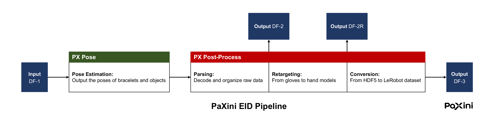

# PX Pipeline: PaXini's Data Processing Toolkit
[](https://omnisharingdb.paxini.com/)
[](https://huggingface.co/datasets/paxini/Omnisharing_DB_SampleData)

## Overview


The post-processing pipeline for **PaXini's Super EID Factory** involves the following stages:         

| Stage | File | Description |
|-----------|-----------| -----------------|
|   **DF-1**   | HDF5 | The overall input: raw data after preprocessing and quality inspection |
|   **DF-2**   | HDF5 | 1st output: DF-1 with encoder and tactile data parsed; adds bimanual and object poses; includes both action and observation |
|   **DF-2R**   | HDF5 |  2nd output: DF-2 retargeted to a dexterous hand model |
|   **DF-3**   | LeRobot Dataset | 3rd output: converts DF-2R to the LeRobot dataset format; can be used for model training |

**PX Pipeline** prepares raw data (DF-1) and transforms them into various formats for downstream application (e.g. large scale pre-training and simulation). It consists of the following modules, which can be run sequentially:          

| Part | Input | Output |
| ---------- | --------------- | --------------- |
| **PX Pose** | DF-1 | Bimanual poses and (optional) object poses |  
| **PX Post-Process** | (a) DF-1; (b) Output of PX Pose | DF-2, DF-2R, DF-3 |

The overall outputs are DF-2, DF-2R, and DF-3 data. We release **PX Omnisharing**, samples of our DF-2 data, on [Hugging Face](https://huggingface.co/datasets/paxini/Omnisharing_DB_SampleData).

## Env setup 
### Prerequisite
- **OS:** Ubuntu 20.04 or 22.04            
- **Architecture:** x86_64             
- **System Resource:** At least 32 GB of RAM and 64 GB of storage; NVIDIA GPU with > 16 GB of VRAM       
- **NVIDIA Driver:** >= 555.42.06 and < 580
- **Software:** Docker

### Install NVIDIA Container Toolkit                 
```bash
# [HOST]
curl -fsSL https://nvidia.github.io/libnvidia-container/gpgkey | \
  sudo gpg --dearmor -o /usr/share/keyrings/nvidia-container-toolkit-keyring.gpg       

curl -fsSL https://nvidia.github.io/libnvidia-container/stable/deb/nvidia-container-toolkit.list | \
  sed 's#deb https://#deb [signed-by=/usr/share/keyrings/nvidia-container-toolkit-keyring.gpg] https://#' | \
  sudo tee /etc/apt/sources.list.d/nvidia-container-toolkit.list      
   
sudo apt-get update && sudo apt-get install -y nvidia-container-toolkit
sudo nvidia-ctk runtime configure --runtime=docker
sudo systemctl restart docker
```

### Add the current user to Docker group
```bash
# [HOST]
sudo systemctl enable --now docker
sudo usermod -aG docker "${SUDO_USER:-$USER}"

# Re-login to pick up the new group 
# - Desktop: log out/in of your shell
# - SSH session: exit, and reconnect
```

### Initialization
Docker image `px_pipeline` includes the whole pipeline.
```bash
# [HOST]
docker pull paxiniaz/px_pipeline:0.1.3

# Enter the container and mount a workspace
# Example: bash first_run.sh /home/alice/data
cd entry
bash first_run.sh <workspace_to_be_mounted>

# [CONTAINER]
cd /home/app/pipeline
bash build_all.sh 
```
Inside the container, the mounted workspace is located at `/ws`. All scripts required for running the pipeline are under `/home/app/pipeline`.        
Note that `first_run.sh` and `build_all.sh` only needs to be executed once.                       
To reenter the container, please run:
```bash
# [HOST]
docker start px_pipeline
docker exec -it px_pipeline bash
```

## Run the demo
You can run a _single script_ that demonstrates how the complete pipeline works. The outputs (DF-2, DF-2R, DF-3) will be written to the default directories. 

```bash
# [CONTAINER]
cd /home/app/pipeline
bash run_demo.sh <input_dir> <output_dir> <hand_model>

# Example: 
# bash run_demo.sh /ws/sample/group_1 /ws/output_1 dexh13
# bash run_demo.sh /ws/sample/group_2 /ws/output_2 dexh13
``` 
We provide [two groups of sample inputs](sample). Group 1 demonstrates post-processing without object poses, and Group 2 is the "complete" input including HDF5 and masks. Please refer to the [tutorial of pose estimation](docs/tutorial_pose.md) for their meaning.              

## Run on PaXini's Dataset
To run on a large-scale dataset instead of the small samples, we strongly recommend that you follow the instructions in this section, and process the data in two stages. Each stage (Pose or Post-Process) requires different resources:
| Part | Critical Resource | Recommendations |  
| ----- | ----- | ----- | 
| **PX Pose** | GPU | Multiple GPUs |  
| **PX Post-Process** | CPU and RAM | Capable CPU with abundant RAM <br> No requirements for GPU  

**Parallel processing**: To increase the efficiency, we recommend running the  container with CPU pinning and GPU binding, so that you can run multiple tasks simultaneously on a server.      

Please first run [Part 1](docs/tutorial_pose.md), and then run [Part 2](docs/tutorial_post_process.md). Both parts utilize **the same container** that you have loaded and initialized.     

## Output      
A series of outputs will be generated by the pipeline, including the hand poses, object poses, and three types of data files: DF-2, DF-2R, and DF-3.       

### Pose results
Part 1 of the pipeline estimates the 6D poses of both hands and (optional) objects. Details can be found in the [tutorial of pose estimation](docs/tutorial_pose.md).  

### DF-2, DF-2R & DF-3
After following the instructions in [Part 2](docs/tutorial_post_process.md), the original DF-1 and estimated poses will be transformed to these three formats. Please check the [data specification](docs/data_structure.md) for the content of each stage.

## License

| Component | Type | License | Commercial Use |
|-----------|------|---------|----------------|
| Python Package (.whl) | Binary | Proprietary | Requires License |
| Python Package (.py) | Source | MIT | Yes |
| Documentation | Source | MIT | Yes |
| Bracelet Detection Model | Model weights (.pt) | Proprietary | Requires License |
| Datasets | Source | CC-BY-NC-SA 4.0 | No |
| Other Runtime Components (executables, object code, etc.) | Binary | Proprietary | Requires License |    

## Installation & Usage Rights 
Research/Education Use

## Acknowledgment
We would like to thank the authors of [IINet](https://github.com/blindwatch/IINet), [FoundationPose](https://github.com/NVlabs/FoundationPose), [YOLO](https://github.com/ultralytics/ultralytics), [manotorch](https://github.com/lixiny/manotorch), and [PyTorch Robot Kinematics](https://github.com/UM-ARM-Lab/pytorch_kinematics) for releasing their code and/or model, which we built upon in our open toolkit. This project would not be possible without the standardized and scalable system of [LeRobot](https://github.com/huggingface/lerobot). Also, thanks to the authors of [FoundationPose++](https://github.com/teal024/FoundationPose-plus-plus) for their very helpful Kalman filter.                 
