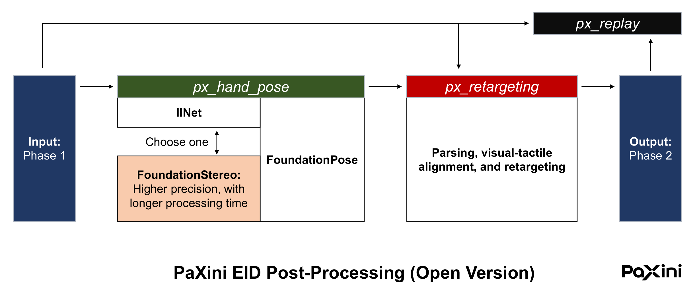

# PX OmniSharing Toolkit

[TOC]

PX OmniSharing is a comprehensive toolkit for data processing and sharing. It is the freeware version of our data post-processing tool, supporting a complete workflow from raw human data to our model’s training data. The toolkit has three parts: **PX Hand Pose**, **PX Retargeting**, and **PX Replay**.

Here we present **Part 1 (of 3): PX Hand Pose**

# Overview 



Our processing pipeline involves two data categories: Phase 1 and Phase 2.

| Category | Description |
|----------|----------|
| **Phase 1**   | Raw data after preprocessing. HDF5 file. |
| **Phase 2**   | Data retargeted to the DH13 configuration; <br>can be organized for VTLA model training. HDF5 file. |

The pipeline is separated into 2 stages: **PX Hand Pose** and **PX Retargeting**             
| | Input | Output |
|------|----------|----------|
| **PX Hand Pose**   | Phase 1 | 6D Bracelet Poses |
| **PX Retargeting**   | a. Phase 1 <br> b. 6D Bracelet Poses  | Phase 2 |

Video and audio recorded during data acquisition are included in the final Phase 2 output.       

**PX Replay** is the visualization module.

# Installation
## Requirements
PX Hand Pose requires 2 Conda environments: `env_bracelet_1` and `env_bracelet_2`. We will explain how to set them up shortly. 

We recommend at least 10 GB of VRAM, and a system with multiple GPUs (optional). The toolkit also requires 24 GB of DRAM and 40 GB of storage space.

To improve pose estimation, we trained our own detection model on diverse scenarios and customized the codebase (including new interfaces) to match our data format. Use the code in this repository; upstream code from [IINet](https://github.com/blindwatch/IINet?tab=readme-ov-file), [FoundationStereo](https://github.com/NVlabs/FoundationStereo) or [FoundationPose](https://github.com/NVlabs/FoundationPose) is not drop-in compatible. 

## Choose the methods of depth estimation: IINet or FoundationStereo
As depicted in the **Overview**, the first stage of PX Hand Pose is estimating depth from stereo pairs. We provide two options: either [IINet](https://github.com/blindwatch/IINet?tab=readme-ov-file) or [FoundationStereo](https://github.com/NVlabs/FoundationStereo). The choice is yours.

**IINet** is much faster (real-time), and its installation requires much less effort. On the other hand. **FoundationStereo** produces point cloud with higher quality. 

## Install CUDA 11.8
All vision-related code requires CUDA 11.8. Please follow the [official instructions from NVIDIA](https://developer.nvidia.com/cuda-11-8-0-download-archive)
```bash
# recommended: edit your system .bashrc file
# inside .bashrc:
export PATH=$PATH:/usr/local/cuda-11.8/bin
export LD_LIBRARY_PATH=${LD_LIBRARY_PATH}:/usr/local/cuda-11.8/lib64
export CUDA_HOME=/usr/local/cuda-11.8

source ~/.bashrc
```

Ensure your NVIDIA Driver is compatible with CUDA 11.8.

## Clone the repo
```bash
git conle https://github.com/px-DataCollection/px_omnisharing_dataprocess_kit.git
cd px_omnisharing_dataprocess_kit/px_hand_pose
```

## Set up the `env_bracelet_1` environment for IINet
```bash
# at the project root
cd iinet

conda create -n env_bracelet_1 python=3.9
conda activate env_bracelet_1

pip install -r requirements.txt
```

## (experimental) Set up the `env_bracelet_1` environment for FoundationStereo 
If you need higher-accuracy depth estimation, please follow [FoundationStereo](https://github.com/NVlabs/FoundationStereo) to setup `env_bracelet_1`, and download model weights to use them with our code. In our evaluation, most episodes produce similar bracelet poses. The higher-precision depth mainly helps in complex scenes (e.g., many objects in frame, high texture diversity, and non-standard lighting).

The code of this section can be found in [experimental](experimental). After the installation, please run `exp_bimanual_pose.sh` instead of the default `bimanual_pose.sh`.

## Set up the `env_bracelet_2` environment
```bash
# at the project root
cd FoundationPose/FoundationPose     

conda create -n env_bracelet_2 python=3.9
conda activate env_bracelet_2

conda install conda-forge::eigen=3.4.0
export CMAKE_PREFIX_PATH="$CMAKE_PREFIX_PATH:<your Eigen path, e.g., ~/anaconda3/envs/env_bracelet_2/include/eigen3>"

python -m pip install -r requirements.txt

python -m pip install --quiet --no-cache-dir git+https://github.com/NVlabs/nvdiffrast.git

# Kaolin (Optional, needed if running model-free setup)
python -m pip install --quiet --no-cache-dir kaolin==0.15.0 -f https://nvidia-kaolin.s3.us-east-2.amazonaws.com/torch-2.0.0_cu118.html

python -m pip install --quiet --no-index --no-cache-dir pytorch3d -f https://dl.fbaipublicfiles.com/pytorch3d/packaging/wheels/py39_cu118_pyt200/download.html

# build extensions
CMAKE_PREFIX_PATH=$CONDA_PREFIX/lib/python3.9/site-packages/pybind11/share/cmake/pybind11 bash build_all_conda.sh

# install other dependencies
pip install h5py
pip install ultralytics==8.3.141
```

If the `build extensions` step fails and the error messages refer to Eigen3, it is likely that your compiler finds an unwanted version of Eigen3 during compilation. The solution is to modify `bundlesdf/mycuda/setup.py` and explicitly assign the Eigen3 path. For example:

```python
    include_dirs=[
        "~/anaconda3/envs/env_bracelet_2/include/eigen3",
        # "/usr/include/eigen3", # or this line, just put 1 path here
    ],
```
Please refer to [the original repo](https://github.com/NVlabs/FoundationPose) if you encounter other errors during installation.

# Running
## Preparation
First, generate the engine for depth estimation:
```python
  # at the project root
  conda activate env_bracelet_1
  cd iinet

  python pt2onnx.py
  python onnx2trt.py # could take several minutes
```
After running these scripts, check whether `iinet.engine` is inside `iinet/checkpoints`     

`bimanual_pose.sh` in `main` folder automatically estimates bracelet poses from input data.          
The script assumes `anaconda3` and `GPU 0`. For example:  
```bash
# 4.1 Preparing data for FoundationPose: Right
cd $SCRIPT_DIR
cd ../FoundationPose/src
export CUDA_VISIBLE_DEVICES=0
find "$VIS_INTMD_DIR" -type d -mindepth 1 -maxdepth 1 2>/dev/null | while read dir; do
  if [ -r "$dir" ]; then
    foundationpose_source="$dir/$RGBD_A"
    cp "$foundationpose_source/${RGBD_A}_color_intrinsic.txt" "$foundationpose_source/cam_K.txt"

    ~/anaconda3/envs/env_bracelet_2/bin/python yolo_for_bracelet_mask.py --source_dir $foundationpose_source --model_path "$BRACELET_MODEL" --obj_name_list bracelet_649

  else
      echo "Unauthorized at: $dir" >&2
  fi
done
```
Please go through the script, and modify **every** `CUDA_VISIBLE_DEVICES` and `~/anaconda3/envs/...` according to your system.      
In addition, save a copy of the `vis_res` folder before running the script.     

## How to run
```bash
cd main
chmod +x bimanual_pose.sh
./bimanual_pose.sh ...
# usage: ./bimanual_pose.sh <input_dir> <depth cam index> <use_left_hand>
# input_dir: the folder with input HDF5 file (Phase 1)
# depth_cam_index: the index of stereo camera. 
# use_left_hand: true/false
```
- For the **input_dir**, please ensure your folder contains **only one** Phase 1 HDF5 file. PX Hand Pose will overwrite the `vis_res` directory every time.    
- **depth_cam_index** can be either 0, 1, or 2. It specifies the stereo camera from which we estimate the bracalet poses. In most cases, `0` produces the best result.     
- **use_left_hand** can be set to either `true` or `false`. If the left bracelet is not visible in the current input episode, set it to `false`; otherwise, set it to `true` so that both bracelets can be processed.


