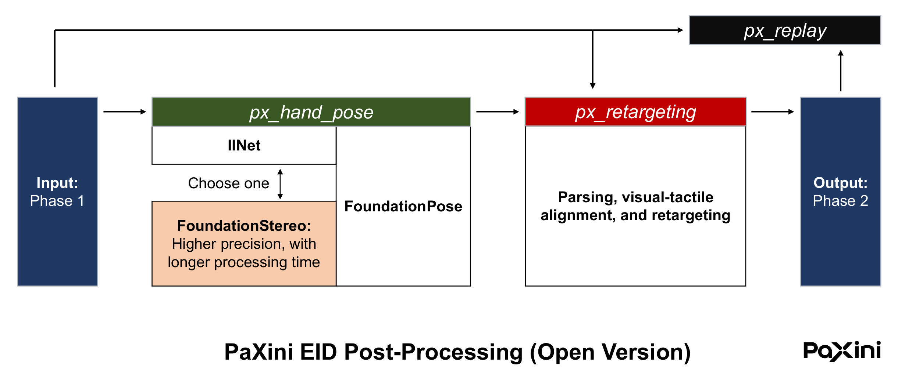

# PX OmniSharing Toolkit

- [PX OmniSharing Toolkit](#px-omnisharing-toolkit)
- [Overview](#overview)
- [Requirements](#requirements)
- [Installation](#installation)
- [Running Instruction](#running-instruction)
  - [Parse the Phase 1 (input) data and output videos](#parse-the-phase-1-input-data-and-output-videos)
  - [Replay the Phase 2 (DH13) data in Isaac Sim](#replay-the-phase-2-dh13-data-in-isaac-sim)
    - [Sending the mock data to simulator](#sending-the-mock-data-to-simulator)
    - [Start the simulator](#start-the-simulator)

PX OmniSharing is a comprehensive toolkit for data processing and sharing. It is the freeware version of our data post-processing tool, supporting a complete workflow from raw human data to our model’s training data. The toolkit has three parts: **PX Hand Pose**, **PX Retargeting**, and **PX Replay**.

Here we present **Part 3 (of 3): PX Replay**    

# Overview 



Our processing pipeline involves two data categories: Phase 1 and Phase 2.

| Category | Description |
|----------|----------|
| **Phase 1**   | Raw data after preprocessing. HDF5 file. |
| **Phase 2**   | Data retargeted to the DH13 configuration; <br>can be organized for VTLA model training. HDF5 file. |

The pipeline is separated into 2 stages: **PX Hand Pose** and **PX Retargeting**             
| | Input | Output |
|------|----------|----------|
| **PX Hand Pose**   | Phase 1 | 6D Bracelet Poses |
| **PX Retargeting**   | a. Phase 1 <br> b. 6D Bracelet Poses  | Phase 2 |

Video and audio recorded during data acquisition are included in the final Phase 2 output.      

**PX Replay** is the visualization module.  

# Requirements   
[FFmpeg](https://ffmpeg.org/)       
[Isaac Lab](https://isaac-sim.github.io/IsaacLab/main/index.html)      

Notice: `parse_videos.py` only requires [FFmpeg](https://ffmpeg.org/)

# Installation
```python
cd px_omnisharing_dataprocess_kit/px_replay

source env.sh
pip install -r requirements.txt
pip install -e . 
```

# Running Instruction
## Parse the Phase 1 (input) data and output videos
Run `parse_videos.py`.  
```python
cd visual_scripts/phase_1
python parse_videos.py --source_dir ... --results_dir ...

# params:
#     --source_dir: the directory containing Phase 1 HDF5 file(s)
#     --results_dir: designated directory for output videos
```

## Replay the Phase 2 (DH13) data in Isaac Sim
```python
cd visual_scripts/phase_2
```

#### Sending the mock data to simulator
```python
python visualization_data_sender.py --load_data_path .../*.hdf5

# params:
#     --load_data_path: followed by the path to Phase 2 data.
#     --use_left_hand: is True by default. Set it to False if left hand should be ignored
```
#### Start the simulator
```python
python IsaacSim_DH13_action.py --enable_cameras

# params:
#     --enable_cameras
#     --use_left_hand: is True by default. Set it to False if left hand should be ignored
```
