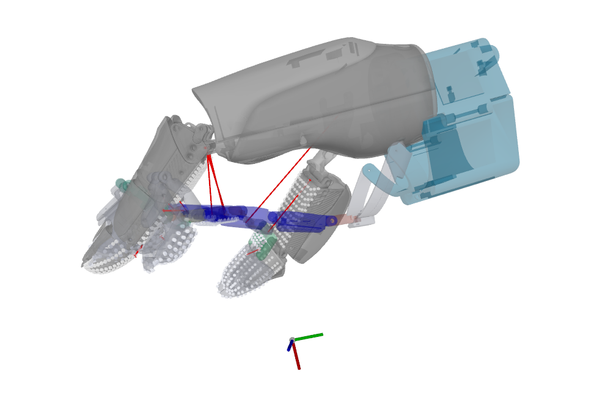

# PX OmniSharing Toolkit

- [PX OmniSharing Toolkit](#px-omnisharing-toolkit)
- [Overview](#overview)
  - [Clone the repo](#clone-the-repo)
  - [Set up the Conda environment](#set-up-the-conda-environment)
- [Running](#running)
  - [Using the test data as input](#using-the-test-data-as-input)


PX OmniSharing is a comprehensive toolkit for data processing and sharing. It is the freeware version of our data post-processing tool, supporting a complete workflow from raw human data to our model’s training data. The toolkit has three parts: **PX Hand Pose**, **PX Retargeting**, and **PX Replay**.

Here we present **Part 2 (of 3): PX Retargeting**

# Overview 


Our processing pipeline involves two data categories: Phase 1 and Phase 2.

| Category | Description |
|----------|----------|
| **Phase 1**   | Raw data after preprocessing. HDF5 file. |
| **Phase 2**   | Data retargeted to the DH13 configuration; <br>can be organized for VTLA model training. HDF5 file. |

The pipeline is separated into 2 stages: **PX Hand Pose** and **PX Retargeting**             
| | Input | Output |
|------|----------|----------|
| **PX Hand Pose**   | Phase 1 | 6D Bracelet Poses |
| **PX Retargeting**   | a. Phase 1 <br> b. 6D Bracelet Poses  | Phase 2 |

Video and audio recorded during data acquisition are included in the final Phase 2 output.    

**PX Replay** is the visualization module.

# Installation
## Clone the repo
```bash
git clone https://github.com/px-DataCollection/px_omnisharing_dataprocess_kit.git
cd px_omnisharing_dataprocess_kit/px_retargeting/
```

## Set up the Conda environment
```bash
conda create -n env_retargeting python=3.10
conda activate env_retargeting

source env.sh
./install.sh 
```

# Running   
## Using the test data as input
```bash
px_retarget --input .../test_data/test_episode_1/vis_res --output ...
```
Ensure the input data directory is set to the `vis_res` level.        
Files in `vis_res` are the standard output of [px_hand_pose](../px_hand_pose). If you have separate files of raw data (phase 1) and/or bracelet poses, please organize them in the same manner before running `px_retargeting`.        


